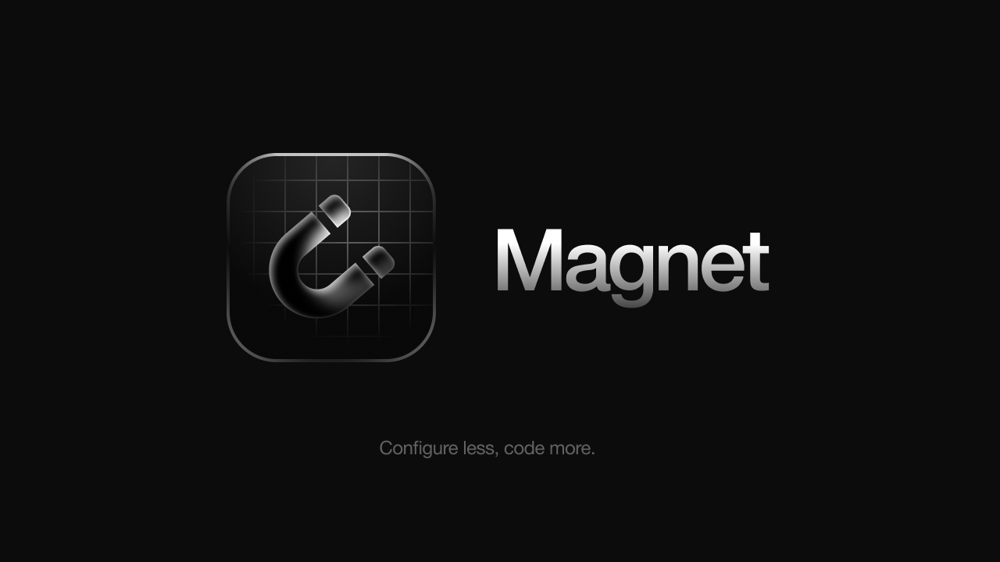

- 🧲 Magnet is a minimalist dependency manager for your next C++ project.
- 🏗 Currently, it is not production ready and thus should be used carefully.️

<br>

# 💫 Features

| Feature                                                                                      | Ready? |
|----------------------------------------------------------------------------------------------|--------|
| CLI tool                                                                                     | ✅      |
| Global command `magnet`                                                                      | ✅      |
| No lock-in                                                                                   | ✅      |
| Run Magnet on existing projects                                                              | ❌      |
| Bootstrap a new C++ project with a single command                                            | ✅      |
| Fine tuning after project creation (customize README, LICENSE, .gitignore, etc.)             | ✅      |
| Edit individual CMakeLists.txt files for full customization                                  | ❌      |
| Automatically generate CMakeLists.txt files based on your dependencies and project structure | ✅      |
| Pull dependencies from GitHub                                                                | ✅      |
| Switch dependency branch                                                                     | ✅      |
| Remove installed dependencies                                                                | ✅      |
| Pull dependencies from GitLab                                                                | ❌      |
| Pull dependencies from BitBucket                                                             | ❌      |
| macOS support (Xcode / Ninja generator)                                                      | ✅      |
| Windows support (Visual Studio 17 / Ninja generator)                                         | ✅      |
| Linux support (Ninja generator)                                                              | ✅      |
<br>
See FAQ down below for more information.
<br>

# 🚀 Getting Started
Create your brand new C++ project with a single command:
```bash
magnet new
```
<br>

Every time your source code changes, simply run:
```bash
magnet generate
```
to regenerate your project files.

💡 **Note**: If you use CLion, this is done automatically.

<br>

Building your project is as easy as running:
```bash
magnet build
```

<br>

Then, launch your project with:
```bash
magnet go
```
💡 **Note**: This will only work if your project is an executable. Also, the default configuration is `Debug`. To change
that, run `magnet config [Debug/Release]`.

<br>

To install a dependency, run:
```bash
magnet pull <dependency>
```
where `<dependency>` is the GitHub repository of the dependency you want to install.

💡 **Note**: Instead of a full GitHub URL, you can also use the shorthand notation `username/repository`.

💡 **Note**: You can list all installed dependencies by running `magnet pull --list`.

💡 **Note**: If no argument is provided, Magnet will pull all dependencies for this project.
Useful for when cloning a project from GitHub that was created with Magnet.

<br>

To remove a dependency, simply run:
```bash
magnet remove <dependency>
```
where `<dependency>` is the name of the dependency you want to remove.

Yes, removing a git submodule is that easy.

<br>

If you'd like to switch a dependency to a different branch, run:
```bash
magnet switch <dependency> <branch>
```
where `<dependency>` is the name of the dependency you want to switch and `<branch>` is the branch you want to 
switch to.

<br>

That's not all. You can explore every possible command by running:
```bash
magnet help
```


# 🛠️ Installation

Clone repo: `git clone https://github.com/futureblur/magnet.git --recursive`

Follow the instructions for your system:

### macOS:

1. Make sure you have [Homebrew](https://brew.sh/) installed
2. Run the installer: `cd magnet/scripts && chmod +x ./macOSInstaller.sh`:
   - Xcode: `./macOSInstaller.sh --xcode`
   - CLion (Ninja): `./macOSInstaller.sh --ninja`

### Windows:

1. Install [CMake](https://cmake.org/download/)
2. Run your desired installer in `magnet/scripts`:
   - Visual Studio 17: Double-click `WindowsInstaller (Visual Studio 17).bat`
   - CLion (Ninja): Double-click `WindowsInstaller (Ninja).bat`

### Linux:

1. Run the installer: `cd magnet/scripts && chmod +x ./LinuxInstaller.sh && ./LinuxInstaller.sh`

<br>

# 📎 FAQ
### How does Magnet work under the hood?
Magnet is built on top of CMake — the "unofficial" official build system for C++ . It leverages CMake to generate your 
project files, and git submodules to manage your dependencies. 

Think of it like that: Magnet speeds up the process of
setting up a new C++ project, creating CMakeLists.txt files, handling dependencies, and more – without you ever 
writing a single line of CMake code, or executing a single git command.

### Why can't I use Magnet on an existing project?
We are working on a way to make Magnet work on existing projects. Right now, it can only
bootstrap new projects due to fundamental differences of project structures.

### Why can't I edit my CMakeLists.txt files?
Magnet generates these on the fly, everytime you run `magnet generate` or `magnet pull` – hence why any changes **will 
be overwritten**. 

However, support for this is planned for the future.

### Is Magnet a build tool?
No. Magnet is a dependency manager. It delegates the actual building process to CMake.

### Is my project tied to Magnet?
No. Magnet is not a lock-in. You can use Magnet to bootstrap your project, and then never use it again (though this 
defeats the purpose of a dependency manager).

# 🏛️ History

Let’s face it: managing your dependencies in a C++ project is a pain in the butt.

On one hand, you can let existing solutions like Conan or vcpkg handle that, and on the other hand, you could take it on
yourself and embrace the countless hours wasted on setting up a new project with your desired dependencies.

But here’s the problem: when you’re in the middle of creating a project and are searching for a solution, you don’t have
the time to learn new tech.

In fact, you’ll never have time to learn every new tool that probably isn’t worth dedicating your time to. You want
something that can be set up in minutes.

And here’s where Magnet comes into play.

<br>

# 💡 The Idea

We take a different approach. We like to simplify things. To a point where it’s not event possible anymore.

Magnet does not lock you in. You are completely in charge of your entire project. At all times.

Magnet is not a new build tool. Nor does it host packages in a dedicated cloud. Instead, we leverage existing,
battle-tested technologies to do the heavy lifting.

What you see, is what you get.

Installing Magnet for your system takes 60 seconds.
Pulling a dependency, 10 seconds.
Scaffolding a new project, 5 seconds.

Imagine what you could do will all of this free time now.
Say goodbye to unexpected setup errors: allowing you to focus on coding and innovating great products.

<br>

# 📝 License
Magnet is licensed under the [GNU GPLv3](LICENSE) license.
